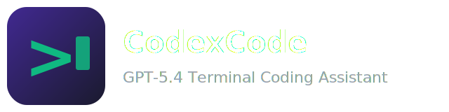

<p align="center">
  
</p>

<p align="center">
  <a href="#quick-start"></a>
  <a href="#architecture"></a>
  <a href="#authentication"></a>
  <a href="#local-testing"></a>
  <a href="#local-testing"></a>
  <a href="#prerequisites"></a>
  <a href="#prerequisites"></a>
  <a href="#%EB%9D%BC%EC%9D%B4%EC%84%A0%EC%8A%A4-%EB%B0%8F-%EB%B2%95%EC%A0%81-%EA%B3%A0%EC%A7%80"></a>
</p>

<p align="center">
  <b>GPT-5.4 powered terminal coding assistant built on the Claude Code architecture</b>
  <br>
  <sub>Primary command: <code>codexcode</code> · Alias: <code>coreline</code> · Direct: <code>bun dist/cli.js</code></sub>
</p>

---

## Overview

**CodexCodeAI** keeps the Claude Code CLI/TUI/tools stack intact and reroutes the backend to **OpenAI Codex**.

| | Shipped State |
|---|---|
| **Executable** | `codexcode` (primary) · `coreline` (alias) |
| **Model** | GPT-5.4 |
| **Auth** | Codex login via `~/.codex/auth.json` |
| **Local gate** | `bun run test:full` (173 pass, 0 fail) |
| **Typecheck** | Recovery in progress ([breakdown](./docs/typecheck-breakdown.md)) |
| **Bundle** | 18 MB (`dist/cli.js`) |

---

## Architecture

```text
┌─────────────────────────────────────────────────┐
│  CLI / Ink TUI / Tools / Commands / Agents      │
│  (original app surface — largely intact)        │
└──────────────────┬──────────────────────────────┘
                   │ anthropic.beta.messages.create()
                   ▼
┌─────────────────────────────────────────────────┐
│  Embedded Proxy  (fetch interceptor)            │
│  src/services/openai/embeddedProxy.ts           │
│                                                 │
│  Anthropic req → Codex input                    │
│  Codex SSE     → Anthropic SSE                  │
│  Tool ID map     call_ → fc_                    │
└──────────────────┬──────────────────────────────┘
                   │ Bearer <access_token>
                   ▼
┌─────────────────────────────────────────────────┐
│  chatgpt.com/backend-api/codex/responses        │
└─────────────────────────────────────────────────┘
```

### Key Runtime Files

| File | Role |
|---|---|
| `src/entrypoints/cli.tsx` | CLI bootstrap, fast-path entry |
| `src/main.tsx` | App bootstrap, Commander, Ink startup |
| `src/services/api/client.ts` | Auth resolution + proxy injection |
| `src/services/api/claude.ts` | Anthropic-shaped request/stream path |
| `src/services/openai/embeddedProxy.ts` | API-boundary translation |
| `src/services/openai/codexAuth.ts` | `~/.codex/auth.json` reader |

---

## Quick Start

### Prerequisites

| Requirement | Version |
|---|---|
| [Bun](https://bun.sh) | >= 1.1 |
| Codex CLI | `codex login` completed |

### Install & Build

```bash
git clone <repo-url> && cd coreline-cli
bun install
bun run build          # → dist/cli.js (18 MB)
```

### Run

```bash
# Interactive
codexcode

# Single prompt
codexcode -p "현재 디렉토리 파일 목록"

# With direct bundle
bun dist/cli.js

# Global command setup
npm link && codexcode --version
```

---

## Authentication

```text
codex login
    ↓
~/.codex/auth.json
    ├── tokens.access_token   → Bearer token (direct use)
    └── tokens.account_id     → ChatGPT-Account-Id header
    ↓
embeddedProxy.ts → chatgpt.com/backend-api/codex/responses
```

> No API key required. No `OPENAI_API_KEY` env var needed.

---

## Common Usage

```bash
# Interactive mode
codexcode

# Skip permissions (sandboxed environments)
codexcode --dangerously-skip-permissions

# Non-interactive single prompt
codexcode --print --bare --dangerously-skip-permissions --max-turns 1 "Reply OK."

# Diagnostics
codexcode doctor
codexcode --help
codexcode --version
```

---

## Local Testing

### Test Commands

| Command | Purpose | Status |
|---|---|---|
| `bun run test:runtime` | Runtime regression suite |  |
| `bun run test:proxy` | Embedded proxy / converter suite |  |
| `bun run test:smoke` | Buildless CLI smoke test |  |
| `bun run test:full` | Build → Runtime → Proxy → Smoke |  |
| `bun run test:full:strict` | test:full + typecheck |  |
| `bun run test:oneshot` | One-shot local gate with logs |  |
| `bun run test:oneshot:strict` | One-shot + typecheck |  |
| `bun run typecheck` | TS debt tracking |  |

### Recommended Order

```bash
bun run test:runtime     # fast unit tests
bun run test:proxy       # conversion layer
bun run test:full        # full local gate
```

### One-Shot Gate

```bash
bun run test:oneshot     # logs → /tmp/coreline-cli-oneshot/<timestamp>/
```

---

## Features

### Preserved App Surface

| Category | Description |
|---|---|
| **TUI** | Full Ink terminal UI with streaming output |
| **Tools** | 54+ tools (Bash, FileRead, FileWrite, Grep, Glob, Agent, ...) |
| **Commands** | `/help`, `/model`, `/config`, `/clear`, `/exit`, ... |
| **Agents** | Sub-agent spawning, background tasks |
| **MCP** | Model Context Protocol server/client |
| **Sessions** | Conversation persistence, history, editing |

### CodexCodeAI-Specific

| Feature | Description |
|---|---|
| Codex auth | `~/.codex/auth.json` — no API key |
| Embedded proxy | Fetch interceptor, zero-config API translation |
| GPT-5.4 | Default model path |
| `codexcode` command | Primary executable + `coreline` alias |
| Self-test scripts | `scripts/` — runtime, proxy, smoke, full, oneshot |
| Korean IME | Coalesced enter handling for CJK input |
| Status line safety | Interactive shell wrappers blocked for TTY safety |

---

## Known Limitations

### TypeScript Recovery

`typecheck` is not yet green. Tracked in [`docs/typecheck-breakdown.md`](./docs/typecheck-breakdown.md).

### Gated / Stubbed Features

Some `claude.ai`-only features are intentionally gated or stubbed in external builds:

| Feature | Status | Reason |
|---|---|---|
| Voice / audio | Stubbed | Requires native `audio-capture-napi` |
| Computer Use | Stubbed | Requires macOS native modules |
| Chrome browser tools | Stubbed | Requires native MCP |
| Syntax highlighting | Fallback | `color-diff-napi` returns null → plain text |
| Remote / channels | Reduced | Some paths gated to `claude.ai` |

### Status Line Safety

Interactive shell wrappers (`zsh -i -c ...`, `bash -i -c ...`) are blocked in status line hooks to prevent TTY corruption. Use direct non-interactive commands instead.

---

## Troubleshooting

```bash
# Health check
codexcode doctor

# If interactive startup looks broken
bun dist/cli.js --debug-to-stderr 2>/tmp/debug.log

# If build fails
bun install && bun run build

# If auth fails
codex login
cat ~/.codex/auth.json | head -5
```

---

## Project References

| Document | Description |
|---|---|
| [`CLAUDE.md`](./CLAUDE.md) | AI assistant instructions |
| [`SKILL.md`](./SKILL.md) | Project conventions |
| [`docs/testing.md`](./docs/testing.md) | Test commands guide |
| [`docs/typecheck-breakdown.md`](./docs/typecheck-breakdown.md) | Typecheck recovery snapshot |
| [`docs/history_review.md`](./docs/history_review.md) | 11 analysis iterations |
| [`scripts/README.md`](./scripts/README.md) | Test script documentation |

---

## 라이선스 및 법적 고지


### 교육 및 연구 목적 전용

이 프로젝트는 **교육 및 연구 목적으로만** 제공됩니다.
상업적 사용, 배포, 재판매는 일체 금지됩니다.

### 원본 프로젝트 권리 고지

이 소프트웨어는 [Anthropic PBC](https://anthropic.com)의 **Claude Code** 아키텍처를 기반으로
학습 및 연구 목적에서 구축된 파생 프로젝트입니다.

- **Claude Code**의 모든 권리는 Anthropic PBC에 귀속됩니다.
- 이 프로젝트는 Anthropic의 공식 제품이 아니며, Anthropic의 후원·보증·승인을 받지 않았습니다.
- 원본 프로젝트의 라이선스: [Anthropic Legal](https://code.claude.com/docs/en/legal-and-compliance)

### 사용 허가 범위

| 허가 | 금지 |
|---|---|
| 개인 학습 및 연구 | 상업적 사용 |
| 학술 논문·발표 인용 | 재배포 및 재판매 |
| 비공개 수정 및 실험 | 원본 프로젝트 사칭 |
| 교육 자료 참고 | 서비스 운영 (SaaS 포함) |

### 면책 조항

이 소프트웨어는 **"있는 그대로(AS IS)"** 제공되며, 어떠한 종류의 보증도 제공하지 않습니다.
저작자는 이 소프트웨어의 사용으로 인해 발생하는 어떠한 손해에 대해서도 책임을 지지 않습니다.

자세한 내용은 [LICENSE](./LICENSE) 파일을 참조하세요.

---

<p align="center">
  <sub>Built on the Claude Code architecture · Powered by GPT-5.4 via OpenAI Codex</sub>
</p>
